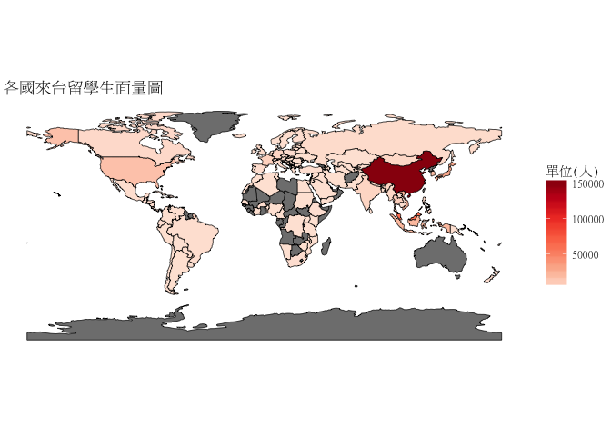

106-2 大數據分析方法 作業二
================
Yi-Ju Tseng

作業完整說明[連結](https://docs.google.com/document/d/1aLGSsGXhgOVgwzSg9JdaNz2qGPQJSoupDAQownkGf_I/edit?usp=sharing)

學習再也不限定在自己出生的國家，台灣每年有許多學生選擇就讀國外的大專院校，同時也有人多國外的學生來台灣就讀，透過分析[大專校院境外學生人數統計](https://data.gov.tw/dataset/6289)、[大專校院本國學生出國進修交流數](https://data.gov.tw/dataset/24730)、[世界各主要國家之我國留學生人數統計表](https://ws.moe.edu.tw/Download.ashx?u=C099358C81D4876CC7586B178A6BD6D5062C39FB76BDE7EC7685C1A3C0846BCDD2B4F4C2FE907C3E7E96F97D24487065577A728C59D4D9A4ECDFF432EA5A114C8B01E4AFECC637696DE4DAECA03BB417&n=4E402A02CE6F0B6C1B3C7E89FDA1FAD0B5DDFA6F3DA74E2DA06AE927F09433CFBC07A1910C169A1845D8EB78BD7D60D7414F74617F2A6B71DC86D17C9DA3781394EF5794EEA7363C&icon=..csv)可以了解103年以後各大專院校國際交流的情形。請同學分析以下議題，並以視覺化的方式呈現分析結果，呈現103年以後大專院校國際交流的情形。

來台境外生分析
--------------

### 資料匯入與處理

``` r
#載入所需資料
library(readr)
library(dplyr)
Data103Country<-read_csv("https://quality.data.gov.tw/dq_download_csv.php?nid=6289&md5_url=25f64d5125016dcd6aed42e50c972ed0")
Data104Country<-read_csv("https://quality.data.gov.tw/dq_download_csv.php?nid=6289&md5_url=4d3e9b37b7b0fd3aa18a388cdbc77996")
Data105Country<-read_csv("https://quality.data.gov.tw/dq_download_csv.php?nid=6289&md5_url=19bedf88cf46999da12513de755c33c6")
Data106Country<-read_csv("https://quality.data.gov.tw/dq_download_csv.php?nid=6289&md5_url=50e3370f9f8794f2054c0c82a2ed8c91")
Data103school<-read_csv("https://quality.data.gov.tw/dq_download_csv.php?nid=6289&md5_url=a6d1469f39fe41fb81dbfc373aef3331")
Data104school<-read_csv("https://quality.data.gov.tw/dq_download_csv.php?nid=6289&md5_url=8baeae81cba74f35cf0bb1333d3d99f5")
Data105school<-read_csv("https://quality.data.gov.tw/dq_download_csv.php?nid=6289&md5_url=1a485383cf9995da679c3798ab4fd681")
Data106school<-read_csv("https://quality.data.gov.tw/dq_download_csv.php?nid=6289&md5_url=883e2ab4d5357f70bea9ac44a47d05cc")
#新增其他國家來台灣唸書總人數欄位
Data103Country<-mutate(Data103Country,Total_103 = rowSums(Data103Country[,c(-1,-2)]))
Data104Country<-mutate(Data104Country,Total_104 = rowSums(Data104Country[,c(-1,-2)]))
Data105Country<-mutate(Data105Country,Total_105 = rowSums(Data105Country[,c(-1,-2)]))
Data106Country<-mutate(Data106Country,Total_106 = rowSums(Data106Country[,c(-1,-2)]))
# 合併103年後的資料成為一個表格
CountryyearData<-inner_join(Data103Country[,c(1,2,12)],Data104Country[,c(1,2,12)],by=c("洲別","國別"))
CountryyearData<-inner_join(CountryyearData,Data105Country[,c(1,2,12)],by=c("洲別","國別"))
CountryyearData<-inner_join(CountryyearData,Data106Country[,c(1,2,12)],by=c("洲別","國別"))
#整理哪間大學的境外生資料
Data103school$`非學位生-大陸研修生`<-as.numeric(gsub("…",NA,Data103school$`非學位生-大陸研修生`))
Data103school<-mutate(Data103school,Total_103 = rowSums(Data103school[,c(-1,-2,-3)], na.rm = TRUE))
Data104school$`非學位生-大陸研修生`<-as.numeric(gsub("…",NA,Data104school$`非學位生-大陸研修生`))
Data104school<-mutate(Data104school,Total_104 = rowSums(Data104school[,c(-1,-2,-3)], na.rm = TRUE))
Data105school<-mutate(Data105school,Total_105 = rowSums(Data105school[,c(-1,-2,-3)], na.rm = TRUE))
Data106school<-mutate(Data106school,Total_106 = rowSums(Data106school[,c(-1,-2,-3)], na.rm = TRUE))
schoolyearData<-inner_join(Data103school[,c(3,13)],Data104school[,c(3,13)],by = "學校名稱")
schoolyearData<-inner_join(schoolyearData,Data105school[,c(3,13)],by = "學校名稱")
schoolyearData<-inner_join(schoolyearData,Data106school[,c(3,13)],by = "學校名稱")

CountryyearData<- mutate(CountryyearData,total = rowSums(CountryyearData[,c(-1,-2)]))%>%
                 arrange(desc(total),desc(Total_106))

EZ <- read_csv("EZ.csv",locale = locale(encoding = "BIG5"))
colnames(EZ)<-c("國別",   "GEC代碼","二位字母代碼","iso_a3","ISO3166-1三位數字代碼","STANAG_1059Stanag標準化國碼","網際網路" ,"註說")
countryCode<-left_join(CountryyearData[,c(1,2,7)],EZ[,c(1,4)] ,by = "國別")

grep("[A-Z]{3}",countryCode$`iso_a3`,invert=T)
```

    ## [1]   1   8  20  53  59  75 112 114 123

``` r
countryCode[grep("[A-Z]{3}",countryCode$iso_a3,invert=T),]
```

    ## # A tibble: 9 x 4
    ##   洲別   國別               total iso_a3
    ##   <chr>  <chr>              <dbl> <chr> 
    ## 1 亞洲   中國大陸         152524. <NA>  
    ## 2 亞洲   南韓              16948. <NA>  
    ## 3 大洋洲 澳大利亞           1758. <NA>  
    ## 4 美洲   聖文森              359. <NA>  
    ## 5 美洲   聖克里斯多福        267. <NA>  
    ## 6 大洋洲 馬紹爾群島共和國    173. <NA>  
    ## 7 非洲   剛果                 26. <NA>  
    ## 8 歐洲   塞爾維亞共和國       22. <NA>  
    ## 9 亞洲   阿拉伯聯合大公國     14. <NA>

``` r
countryCode$iso_a3[grep("[A-Z]{3}",countryCode$iso_a3,invert=T)]<-c("CHN","KOR","ANZ","VCT","KNA","MHL","COD","SRB","UAR")
```

### 哪些國家來台灣唸書的學生最多呢？

``` r
library(knitr)
knitr::kable(head(CountryyearData[,c(1,2,7)],10))
```

| 洲別 | 國別     |   total|
|:-----|:---------|-------:|
| 亞洲 | 中國大陸 |  152524|
| 亞洲 | 馬來西亞 |   62031|
| 亞洲 | 香港     |   31940|
| 亞洲 | 日本     |   28200|
| 亞洲 | 越南     |   21670|
| 亞洲 | 澳門     |   20302|
| 亞洲 | 印尼     |   19620|
| 亞洲 | 南韓     |   16948|
| 美洲 | 美國     |   14846|
| 亞洲 | 泰國     |    7035|

``` r
#多為亞洲地區來台灣唸書的學生較多，前三名分別為中國大陸 馬來西亞 香港 其他排名如上表可知
```

### 哪間大學的境外生最多呢？

``` r
schoolyearData<-mutate(schoolyearData,Total = rowSums(schoolyearData[,-1], na.rm = TRUE))%>%
                arrange(desc(Total))
knitr::kable(subset(schoolyearData[,c(1,6)],`學校名稱`=="國立台灣師大僑生先修部"))
```

學校名稱 Total --------- ------

``` r
knitr::kable(head(schoolyearData[,c(1,6)],10))
```

| 學校名稱         |  Total|
|:-----------------|------:|
| 國立臺灣師範大學 |  22113|
| 國立臺灣大學     |  18199|
| 中國文化大學     |  16074|
| 銘傳大學         |  16057|
| 淡江大學         |  13887|
| 國立政治大學     |  11626|
| 國立成功大學     |  10982|
| 輔仁大學         |   9499|
| 逢甲大學         |   9474|
| 中原大學         |   7662|

``` r
#如表格所示，國立台灣師範大學的境外生最多
```

### 各個國家來台灣唸書的學生人數條狀圖

``` r
comeTWstudy<-nrow(filter(CountryyearData,total>500))
CountryyearData2<-group_by(CountryyearData,`國別`)%>%
                  tally(total,sort = TRUE)%>%
                  group_by(`國別`=factor(c(`國別`[1:comeTWstudy],rep("other",n()-comeTWstudy)),
                  levels=c(`國別`[1:comeTWstudy],"other"))) %>%
                  tally(n)
library(ggthemes)
library(ggmap)
```

    ## Loading required package: ggplot2

``` r
ggplot(CountryyearData2)+
  geom_bar(aes(x=`國別`,y=nn),stat = "identity")+
  scale_y_sqrt()+
  theme_stata()+scale_colour_stata()+
  theme(axis.text.x = element_text(angle = 90,vjust = 0.3, hjust = 1,size = 8),
        text = element_text(family = "細明體"))+
  labs(y="單位log(人)",title="各國來台留學生長方圖")
```


``` r
#各國來台灣唸書的學生人數以中國大陸為最多，第二的馬來西亞還不到中國大陸的一半
```

### 各個國家來台灣唸書的學生人數面量圖

``` r
library(RColorBrewer)
library(choroplethr)
library(choroplethrMaps)
data(country.map)
final.plot<-merge(country.map,
                  countryCode,by="iso_a3",all.x=T)%>%
  group_by(group)%>%
  arrange(order)

wmap<-ggplot()+ 
      geom_polygon(data = final.plot,
                   aes(x=long,y=lat,group=group,fill=total),
                   color="black",
                   size=0.25,na.rm = T)+
      coord_cartesian(xlim = c(-200, 200) ,ylim = c(-90, 90))+
      coord_fixed()+ #維持地圖比例
      scale_fill_gradientn(colours = brewer.pal(7,"Reds"))+ 
      theme_void()+
  theme(text = element_text(family = "細明體"))+
  labs(fill="單位(人)",title = "各國來台留學生面量圖")
wmap
```



台灣學生國際交流分析
--------------------

### 資料匯入與處理

``` r
library(readr)
library(dplyr)
TWgoout1 <- read_csv("Student_RPT_07.csv", 
                           locale = locale(encoding = "BIG5"))
```

    ## Parsed with column specification:
    ## cols(
    ##   學年度 = col_integer(),
    ##   學期 = col_integer(),
    ##   學校設立別 = col_character(),
    ##   學校類別 = col_character(),
    ##   學校代碼 = col_integer(),
    ##   學校名稱 = col_character(),
    ##   系所代碼 = col_integer(),
    ##   系所名稱 = col_character(),
    ##   學制 = col_character(),
    ##   `對方學校(機構)國別(地區)` = col_character(),
    ##   中文名稱 = col_character(),
    ##   英文名稱 = col_character(),
    ##   小計 = col_integer(),
    ##   男 = col_integer(),
    ##   女 = col_integer()
    ## )

    ## Warning in rbind(names(probs), probs_f): number of columns of result is not
    ## a multiple of vector length (arg 1)

    ## Warning: 17 parsing failures.
    ## row # A tibble: 5 x 5 col     row col      expected               actual file                 expected   <int> <chr>    <chr>                  <chr>  <chr>                actual 1  2340 學校代碼 no trailing characters R01    'Student_RPT_07.csv' file 2  2341 學校代碼 no trailing characters R01    'Student_RPT_07.csv' row 3  2342 學校代碼 no trailing characters R01    'Student_RPT_07.csv' col 4  6076 學校代碼 no trailing characters R01    'Student_RPT_07.csv' expected 5  6077 學校代碼 no trailing characters R01    'Student_RPT_07.csv'
    ## ... ................. ... ................................................................... ........ ................................................................... ...... ............................................................... .... ............................................................... ... ............................................................... ... ............................................................... ........ ...............................................................
    ## See problems(...) for more details.

``` r
TWgoout <-TWgoout1
TWgoout$`小計`<-as.numeric(TWgoout$`小計`)
TWgoout$`男`<-as.numeric(TWgoout$`男`)
TWgoout$`女`<-as.numeric(TWgoout$`女`)

EZ <- read_csv("EZ.csv", 
               locale = locale(encoding = "BIG5"))
```

    ## Parsed with column specification:
    ## cols(
    ##   政治實體 = col_character(),
    ##   GEC代碼 = col_character(),
    ##   `ISO 3166-1二位字母代碼` = col_character(),
    ##   `ISO 3166-0三位字母代碼` = col_character(),
    ##   三位數字代碼 = col_character(),
    ##   Stanag標準化國碼 = col_character(),
    ##   網際網路 = col_character(),
    ##   註說 = col_character()
    ## )

``` r
colnames(EZ)<-c("對方學校(機構)國別(地區)",   "GEC代碼","二位字母代碼","iso_a3","ISO 3166-1三位數字代碼","STANAG_1059Stanag標準化國碼","網際網路"    ,"註說")

TWgoout<-group_by(TWgoout,`對方學校(機構)國別(地區)`)%>% 
  summarise(STtotal = sum(`小計`,na.rm = T))%>%
  arrange(desc(STtotal))
country<-left_join(TWgoout,EZ[,c(1,4)],by="對方學校(機構)國別(地區)")
country$iso_a3[grep("[A-Z]{3}",country$iso_a3,invert = T)]<-
   c("CHN","CHN","KOR","KOR","DEU","ANZ","THA","SGP","ESP","NLD",
     "CZE","AUT","RUS","SWE","PHL","BEL","IDN","VNM","FIN","ITA",
     "POL","TUR","IND","DNK","LTU","NOR","IRL","SVK","KHM","EGY",
     NA,NA,NA,NA,NA,NA,NA,NA,NA,NA,NA,NA,NA,NA,NA,NA,NA,NA,NA,NA,
     NA,NA,NA,NA,NA,NA,NA,NA,NA,NA,NA,NA,NA,NA,NA,NA,NA,NA,NA,NA,NA)

country<-group_by(country,iso_a3)%>% 
  summarise(STtotal = sum(STtotal,na.rm = T))%>%
  arrange(desc(STtotal))
Worldindex<-nrow(filter(country,STtotal>20))

country$iso_a3<-factor(country$iso_a3,
                       levels=c(country$iso_a3[order(country$STtotal,decreasing = T)],"other"))
country<-rbind.data.frame(country%>%filter(STtotal>100),
                          country%>%filter(STtotal<=100)%>%
                          summarise(iso_a3="other",
                                    STtotal=sum(STtotal,na.rm = T)))
```

### 台灣大專院校的學生最喜歡去哪些國家進修交流呢？

``` r
knitr::kable(head(country,10))
```

| iso\_a3 |  STtotal|
|:--------|--------:|
| CHN     |    16425|
| JPN     |    12430|
| USA     |     8916|
| KOR     |     4629|
| DEU     |     3164|
| FRA     |     2415|
| FXX     |     2415|
| GBR     |     1416|
| ESP     |     1252|
| CAN     |     1180|

``` r
#如上表所示，台灣大專院校的學生最喜歡去交流的國家前三名分別為，中國大陸 日本 美國
```

### 哪間大學的出國交流學生數最多呢？

``` r
library(dplyr)
clggoout<-group_by(TWgoout1,`學校名稱`)%>% 
          summarise(STtotal = sum(`小計`,na.rm = T))%>%
          arrange(desc(STtotal))
clggooutindex<-nrow(filter(clggoout,STtotal>20))
clggoout<- group_by(clggoout,`學校名稱`)%>% 
          tally(STtotal,sort = TRUE)%>%
          group_by(`學校名稱`=factor(c(`學校名稱`[1:clggooutindex],rep("other",n()-clggooutindex)),
                       levels=c(`學校名稱`[1:clggooutindex],"other"))) %>%
          tally(n)
knitr::kable(head(clggoout,10))
```

| 學校名稱     |    nn|
|:-------------|-----:|
| 國立臺灣大學 |  4719|
| 淡江大學     |  3794|
| 國立政治大學 |  3479|
| 逢甲大學     |  2646|
| 東海大學     |  1881|
| 元智大學     |  1864|
| 國立交通大學 |  1513|
| 東吳大學     |  1457|
| 國立成功大學 |  1397|
| 國立臺北大學 |  1397|

``` r
#如上表所示，出國交流學生數最多的大學前三名分別為，國立台灣大學 淡江大學 國立政治大學
```

### 台灣大專院校的學生最喜歡去哪些國家進修交流條狀圖

``` r
ggplot(country)+
  geom_bar(aes(x=iso_a3,y=STtotal),stat = "identity")+
  theme_stata()+scale_colour_stata()+
  theme(axis.text.x = element_text(angle = 90,vjust = 0.3, hjust = 1),
        text = element_text(family = "細明體"))+
  labs(x="國家",y="單位(人)",title="最喜歡去國家進修交流條狀圖")
```


``` r
#由條狀圖可以看出台灣大專院校的學生最喜歡去交流的國家前三名分別為，中國大陸 日本 美國
```

### 台灣大專院校的學生最喜歡去哪些國家進修交流面量圖

``` r
library(RColorBrewer)
library(choroplethr)
library(choroplethrMaps)
data(country.map)
final.plot<-merge(country.map,country,by="iso_a3",all.x=T)%>%
            group_by(group)%>%
            arrange(order)

wmap<-ggplot()+ 
  geom_polygon(data = final.plot,
               aes(x=long,y=lat,group=group,fill=STtotal),
               color="black",
               size=0.25,na.rm = T)+
  coord_cartesian(xlim = c(-200, 200) ,ylim = c(-90, 90))+
  coord_fixed()+ 
  scale_fill_gradientn(colours = brewer.pal(7,"Reds"))+ 
  theme_void()+
  theme(text = element_text(family = "細明體"))+
  labs(fill="單位(人)",title = "最喜歡去哪些國家進修交流面量圖")
wmap
```


``` r
#由面量圖很明顯可以看出台灣大專院校的學生最喜歡去交流的國家分別為，中國大陸 日本 美國 又以中國大陸為最多
```

台灣學生出國留學分析
--------------------

### 資料匯入與處理

``` r
library(readr)
library(dplyr)
worldst105 <- read_csv("105年度世界各主要國家之我留學生人數統計表 .csv")
```

    ## Warning: Missing column names filled in: 'X4' [4], 'X5' [5], 'X6' [6]

    ## Parsed with column specification:
    ## cols(
    ##   洲別 = col_character(),
    ##   國別 = col_character(),
    ##   總人數 = col_number(),
    ##   X4 = col_character(),
    ##   X5 = col_character(),
    ##   X6 = col_character()
    ## )

``` r
worldst105_2<-data.frame(worldst105,stringsAsFactors = F)
remove(worldst105)
worldst105_2<-worldst105_2[,c(1,2,3)]
worldst105_2<-worldst105_2%>%arrange(desc(`總人數`))

EZ_2<-EZ[,c(1,4)]
colnames(EZ_2)<-c("國別","iso_a3")
countryCode<-left_join(worldst105_2,EZ_2,by="國別")
countryCode$iso_a3[grep("[A-Z]{3}",countryCode$iso_a3,invert=T)]<-
  c("ANZ")
```

### 台灣學生最喜歡去哪些國家留學呢？

``` r
knitr::kable(head(countryCode[,c(1,2,3)],10))
```

| 洲別   | 國別     | 總人數 |
|:-------|:---------|:------:|
| 美洲   | 美國     |  21127 |
| 大洋洲 | 澳大利亞 |  13582 |
| 亞洲   | 日本     |  8444  |
| 美洲   | 加拿大   |  4827  |
| 歐洲   | 英國     |  3815  |
| 歐洲   | 德國     |  1488  |
| 大洋洲 | 紐西蘭   |  1106  |
| 歐洲   | 波蘭     |   561  |
| 亞洲   | 馬來西亞 |   502  |
| 歐洲   | 奧地利   |   419  |

``` r
#
```

### 台灣學生最喜歡去哪些國家留學面量圖

``` r
#這是R Code Chunk
```

綜合分析
--------

請問來台讀書與離台讀書的來源國與留學國趨勢是否相同(5分)？想來台灣唸書的境外生，他們的母國也有很多台籍生嗎？請圖文並茂說明你的觀察(10分)。
